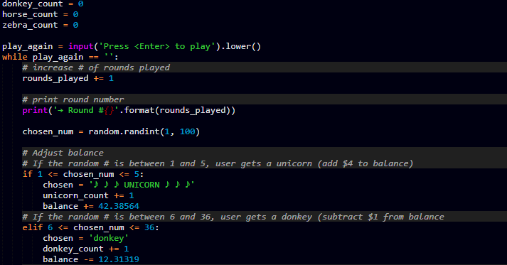
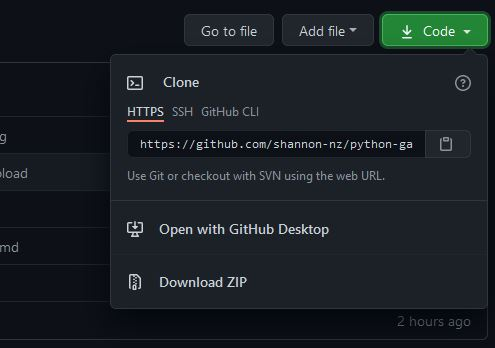
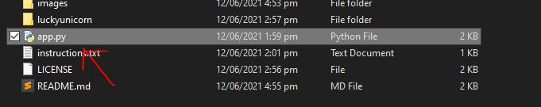
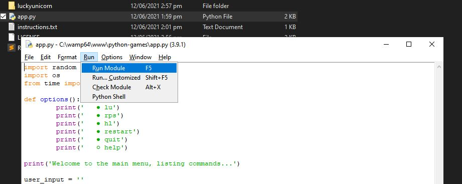

<h1 align="center">🥇🎮 Python Games (In Development) 🎲🔫</h1>
<br><br>
<table>
  <tbody>
    <tr>
      <th>What is Python Games?</th>
    </tr>
    <tr>
      <td align="center">
        This repository contains a set of python games that come with a main menu. I initially made these for a school assesment, but I have decided to add to the repository and develop more custom and advanced games. Once there is enough games, I will catergorize them in the main menu to make it easier to choose what game to play. At the moment, all of the games are text-based only, but grapical games will be added later on this year. Below, you will find out how to set the application up and how to use it. Enjoy!
        <br><br>
        
        <br>
        <i>Snippet of lucky unicorn code</i>
       </td>
      </tr>
    </tbody>
</table>

<br>

**For Python Beginners** : This code would be great for python beginners, who are interested in game development, to start somewhere. I have commented all of the code so everyone will be able to understand what each part of the program does and how it all works. If you would like to make any improvements, feel free to contibute to this repo. If there is something you don't understand, my contact details can be found on my <a href="https://github.com/shannon-nz/">GitHub profile</a> or my <a href="http://shan.rf.gd">Profile Website</a>

<br><br>

# Installation
- Make sure that <a href="https://www.python.org/downloads/">python</a> is installed.
To install the game, you will need to either:
- Clone the repository to a local folder
- Download the zip file and extract it

<div align="center">
  
  <br>
  <i>Where the option are</i>
</div>

<br>

# Getting Started
- **Option 1 (recommended)** - The Easy Option - Simply open the folder that contains the python files and double click app.py. Further instructions will be shown in the app.

<div align="center">
  
  <br>
  <i>Which file to click</i>
</div>

<br>

- Option 2 - Terminal - Use the terminal, to run the application.
Windows:
```
C:\Users\User> cd folder
C:\Users\User> python app.py
```

<br>

- **Option 3** - IDE - Open your IDE, Ctrl + o, open the app.py and press F5.

<div align="center">
  
  <br>
  <i>running the file in IDLE</i>
</div>

<br>

# Commands
### Commands
```
lu
rps
hl
restart
quit
help
```

### Command Details 

- `lu` = lucky unicorn (game) <br>
- `rps` = rock paper scissors (game) <br>
- `hl` = higher/lower (game) <br>
- `system` = get your system information (info) <br>
- `clear` = clear the screen (action) <br>
- `profile` = Open my profile website (website) <br>
- `spaz` = SPAZ YOUR SCREEN for 7 seconds (USE WITH CAUTION) <br>
- `restart` = restart the application (action) <br>
- `quit` = quit the entire program (action) <br>
- `help` = display command details (help) <br>

<br>

# Game Details
### Lucky Unicorn
Lucky Unicorn is essentially a luck-based game. Here are the steps to playing the game: <br>
1. Type `lu` in the main menu.
2. If you have played the game before type `yes` or `y`, otherwise type `no` or `n`.
3. Choose the pretend amount of money you want to spend, you can choose from 0 to 100.
4. Simply press <enter> each round or type `quit` to quit the game.
5. When the game finished, you will be directed back to the main menu.
