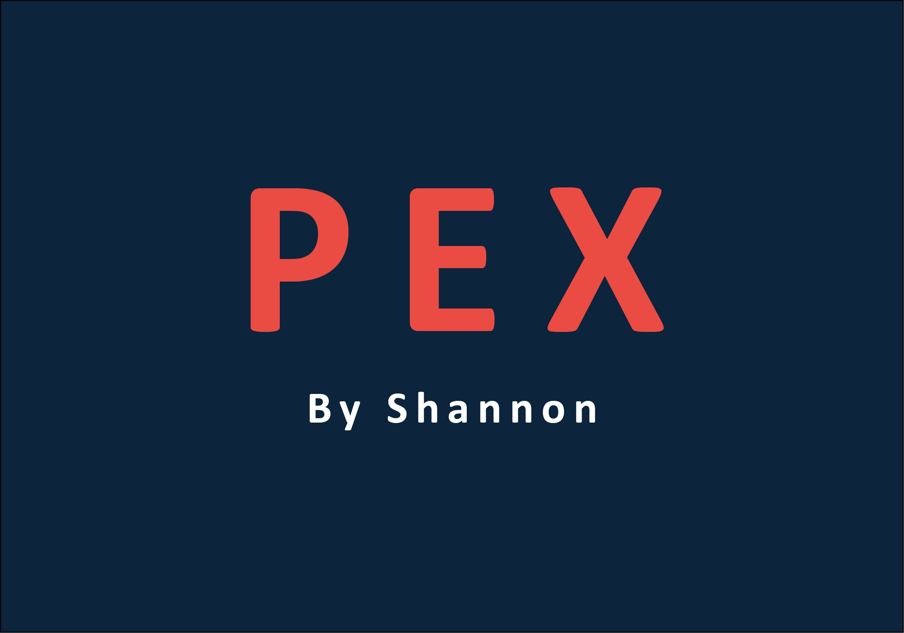

<h1 align="center">PEX Documentation (in development)</h1>



<p>
  <h2>What is PEX?</h2>
    The name PEX is not owned by me and its short for Python Experimental. As you would guess, this is just an experimental app based off exploring what is possible with python. This app started off as school project were I develop some games for an assessment, but I decided to make it into something more. With the assurance that I will be including comments of course. At the moment, everything is text-based and does not have a GUI, this may change in the future, but not anytime soon.
  <br><br>
  As I am sure I am only scratching the surface of the capabilities of python, I am uncovering lots of interesting things. With this, a lot of new modules are involved, so make sure you are okay with installing them. Below you will find the full documentation of the application and how to use it. If you find that there are any issues with the documentation or program, then feel free to edit it, bring up an issue or contact me. Enjoy!

</p>

</br>

<table align="center">
  <tbody>
    <tr>
      <th>Table of contents</th>
    </tr>
    <tr>
    <!-- width 350px -->
      <td width="350px">
      </br>
        <ul>
          <li>
            <a href="#pex-documentation-in-development">PEX</a>
            <ul>
              <li><a href="#what-is-pex">What is PEX?</a></li>
            </ul>
          </li>
          <li><a href="#how-the-app-works">How the app works</a></li>
          <li><a href="#requirements">Requirements</a></li>
          <li><a href="#installation">Installation</a></li>
          <li>
            <a href="#getting-started">Getting Started</a>
            <ul>
              <li><a href="#password-pyga">Password</a></li>
            </ul>
          </li>
          <li>
            <a href="#trouble-shooting">Trouble Shooting</a>
          </li>
          <li>
            <a href="#commands">Commands</a>
            <ul>
              <li><a href="#commands-1">Commands</a></li>
              <li><a href="#command-details">Command Details</a></li>
            </ul>
          </li>
          <li>
            <a href="#game-details">Game Details</a>
            <ul>
              <li><a href="#lucky-unicorn">Lucky Unicorn</a></li>
            </ul>
          </li>
          <li><a href="#to-do--whats-coming">To Do / What's Coming</a></li>
          <li><a href="#advanced">Advanced</a></li>
          <li><a href="#contributing">Contributing</a></li>
        </ul>
      </td>
    </tr>
  </tbody>
</table>

</br>

**For Python Beginners** : This code would be great for python beginners, who are interested in game development, to start somewhere. I have commented all of the code so everyone will be able to understand what each part of the program does and how it all works. If you would like to make any improvements, feel free to contibute to this repo. If there is something you don't understand, my contact details can be found on my <a href="https://github.com/shannon-nz/">GitHub profile</a> or my <a href="http://shan.rf.gd">Profile Website</a>

**For everyone else**: I have attempted to make the setup of the program as simple as possible, but you can refer to the troubleshooting section of you need help or feel free to contact me at <a href="slekupvimplyrataqq@protonmail.com"></a>.

</br>

# How The App Works
In the `config.json` file, you are given a default balance of $100, this is all the money that you are allowed to spend in the game. When you are below $0, you are in debt and will not be able to play anymore. To reset the balance, use the `reset` command. You can also just add unlimited money by changing the `config.json` file and setting the balance to whatever you want (as long as it is a number)

The app will automatically install any module required that are not already installed. These modules are required for the app to function fully. The app will also automatically become full screen, this is done with the keyboard module and using the code:
```
keyboard.press('win+up')
keyboard.release('win+up')
 ```

There are mutliple commands that you can use, some of which are just for the sake of seeing what you can do with python. Some of the code may not make sense if you have not used some of the modules that I am using. If this is the case, you could start in the `/python-games/main/games` folder to find the folders for each game. In the archive folder for each, you will find each of functions as an individual program. This may make it easier to understand.

</br>

# Requirements

<br>

<table align="center">
  <tbody>
    <tr>
     <th>Requirements</th>
      <th>How to meet requirements</th>
    </tr>
    <tr>
      <td>Windows 10</td>
      <td><a href="https://www.wikihow.com/Update-Windows">Click here</a> to learn how to update windows.</td>
    </tr>
    <tr>
      <td>Latest version of python</td>
      <td>Click the installer in the root folder called </td>
    </tr>
    <tr>
      <td>Latest version of pip</td>
      <td>Click on update pip in the root directory</td>
    </tr>
    <tr>
      <td>A stable internet connect</td>
      <td>Especially the first time. You can disable the internet requirement in the main/config.json or with the command `intreq -disable` command</td>
    </tr>
  </tbody>
</table>

<br>

# Installation
Make sure that you have the latest version of <a href="https://www.python.org/downloads/">python</a> installed and that you're using Windows 10. If you do not currently have the latest version of python installed, you can find the installer in the root directory named `python-3.9.5-amd64.exe`. Double click the installer file to install python. When installing, make sure you check `add to path` and `disable path limit`.
<br>
To install the game, you will need to either:
- Clone the repository to a local folder
- Download the zip file and extract it

<div align="center">
  
  </br>
  <i>Where the option are</i>
</div>

<br>

# Getting Started
### Password: `pass`
- **Option 1 (recommended)** - The Easy Option - Simply open the folder that contains the python files and double click app.py. Further instructions will be shown in the app.

<div align="center">
  
  <br>
  <i>Which file to click</i>
</div>

</br>

- Option 2 - Terminal - Use the terminal, to run the application.
Windows:
```
C:\Users\User> cd folder
C:\Users\User> python app.py
```

</br>

- **Option 3 - will not work - (DISCONTINUED) ** - IDE - Open your IDE, Ctrl + o, open the app.py and press F5.

<div align="center">
  
  <br>
  <i>running the file in IDLE</i>
</div>

Running the program in IDLE is now disabled. This is because IDLE lacks the flexability of a terminal, henceforth I have decided to strictly limit the application to the terminal. 

</br>

# Trouble Shooting
<table>
  <tbody>
    <tr>
      <th>Issue</th>
      <th>Potential Fix</th>
    </tr>
    <tr>
      <td>Program closes on first run</td>
      <td>Run the program once again (currently an importing issue)</td>
    </tr>
    <tr>
      <td>Anything else</td>
      <td>Contact me at <a href="slekupvimplyrataqq@protonmail.com">slekupvimplyrataqq@protonmail.com</a> with the `main/data.log` file.</td>
    </tr>
  </tbody>
</table>

</br>

# Commands

Use the `-help` sub-command to list out all the sub-commands for any command, for example `download -help`. You can also list out the full list of commands and sub-commands with the `help -all` command.

### Commands

```
   admin                         perform admin tasks (caution)
   cls                           clear the terminal
   doc                           open python games documentation on GitHub
   download                      download documentations and other things
   help                          display commands and functions
   hl                            play higher/lower game
   log                           view all past logs
   ls                            list directory
   lu                            play lucky unicorn game
   profile                       open my profile website
   quit                          quit the entire program
   rps                           play rock paper scissors game
   restart                       restart the application
   settings                      print settings in JSON format
   shortcuts                     print settings in JSON format
   spaz                          SPAZ YOUR SCREEN for 7 seconds (caution)
   stats                         view your stats
   system                        get your system information
```


<i>When all of the commands have been added, this message will be removed</i>
</br>
You can also clone/pull the repository to recieve the latest commands with the `help` command. I update the commands almost daily, when I stop I will remove this message.

</br>

# Game Details
### Lucky Unicorn
Lucky Unicorn is essentially a luck-based game. Here are the steps to playing the game: <br>
1. Type `lu` in the main menu.
2. If you have played the game before type `yes` or `y`, otherwise type `no` or `n`.
3. Choose the pretend amount of money you want to spend, you can choose from 0 to 100.
4. Simply press <enter> each round or type `quit` to quit the game.
5. When the game finished, you will be directed back to the main menu.
 
</br>

# To Do / What's Coming
- Count the amount of times each program has been run as well as the total
- Rock Paper Scissors game
- Higher/Lower game
- Create modules for large sets of functions
- Finish the Documentaion (last)

To find other tasks that are being or need to be completed, have a look at the <a href="https://github.com/shannon-nz/python-games/issues">issues page for this reposiotory</a>. 

</br>

# Advanced
If you would like to change the application settings, feel free to edit the config.json file on your own copy. I will be adding more settings there, so don't forget to pull from the repo frequently! 

</br>

# Contributing
If you would like to contribute to this project, simply clone the repository, make some changes, and create a pull request. I will review the request and accept it if appropriate. If you would like to contribute to this project or my other projects more than once, feel free to contact me: [slekupvimplyrataqq@protonmail.com](slekupvimplyrataqq@protonmail.com).
Some skills that would be specifically useful to this project are:
- Fundamental knowledge of python
- Tkinter
- Pygame
- Django

If these do not apply to you, then simply starring the repository would be great.
